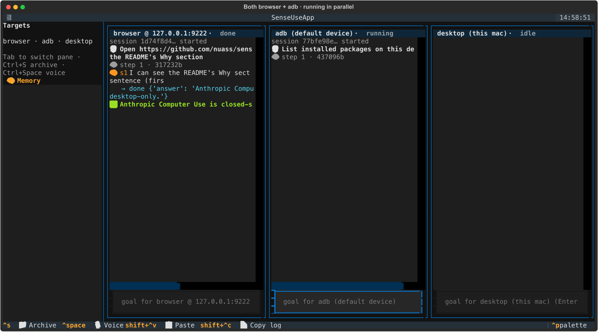
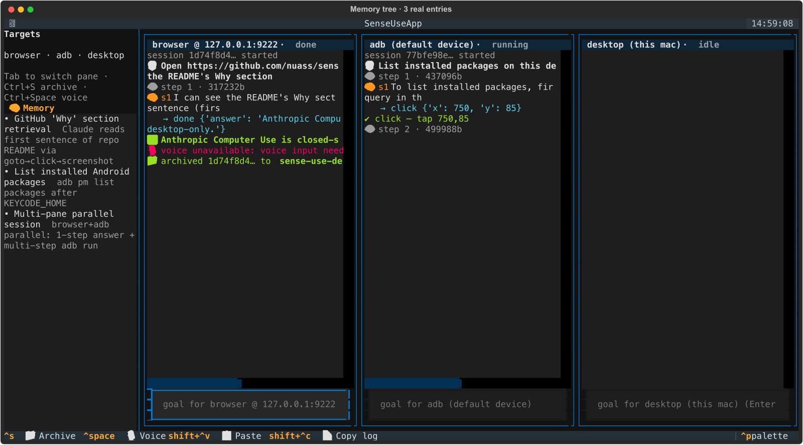
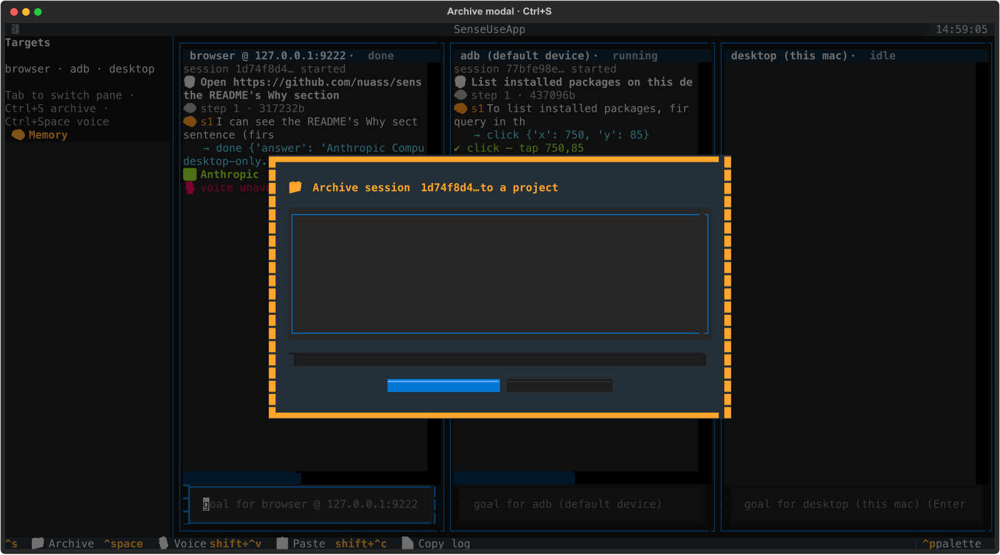

# sense-use

> The missing open-source, self-hosted **Computer + Mobile + Browser Use** — one TUI, floating live viewers, voice-in, all local.

**[中文](README-zh.md) · English**

`sense-use` is the open-source alternative to Anthropic Computer Use — but it also drives your Android phone (ADB), your Chrome (CDP), your local desktop (pyautogui), and remote machines (VNC), from **one Textual TUI**. Each target opens a **floating PyQt viewer** so you can watch (and take over) without covering your terminal.

## Why

- **Anthropic Computer Use** is closed-source and desktop-only.
- **browser-use** is browser-only, no UI.
- **OpenAdapt** is record-and-replay, not an active agent.
- No one ships a **TUI + multi-target floating viewers + mobile + browser + desktop + voice** combo.

That's what `sense-use` is.

## Features

- **Four backends, one CLI**: ADB (Android), Playwright/CDP (Chrome), pyautogui (macOS/Linux/Windows desktop), VNC (remote).
- **Floating live viewers** per target (PyQt6, drag/resize/pin-on-top), so the terminal is never covered.
- **Voice input** via Volc real-time ASR — press `Ctrl+Space` to toggle.
- **Visual memory tree** in the sidebar — Markdown files, git-friendly, click to open & edit inline.
- **Sensitive-action confirmation**: agent stops before "pay / delete / send" — press ✅ / ❌ / 🔁.
- **Project archive** (`Ctrl+S`): save any conversation to an existing or new project.
- **Pluggable model providers**: Volc doubao-seed-vision, Anthropic Claude, OpenAI GPT-4o, local Qwen2.5-VL over Ollama.
- **100% local file storage** under `~/.sense-use/` — no cloud, no account.

## Architecture

```
┌────────────────────────────────────────────────────────────────┐
│                       Textual TUI (main)                       │
│  ┌──────────────┐   ┌──────────────────────────────────────┐   │
│  │  🧠 Memory   │   │  chat / think / act stream           │   │
│  │  tree        │   │  Y/N confirm modal · Ctrl+Space voice │   │
│  └──────────────┘   └──────────────────────────────────────┘   │
└──────────────┬─────────────────────┬───────────────────────────┘
        events │             frames  │  overlay
               ▼                     ▼
      ┌─────────────────┐   ┌──────────────────────────────┐
      │  TaskRunner     │   │  PyQt viewer subprocess      │
      │  (asyncio)      │   │  (unix-socket IPC per target) │
      └─┬───────────────┘   └──────────────────────────────┘
        │                    ▲
        ▼                    │ screenshot bytes
      ┌──────────────────────┴──────────────────────────────┐
      │  Backend (screenshot / click / type / swipe / key)   │
      │  ─ adb · desktop · browser (CDP) · vnc              │
      └──────────────────────────────────────────────────────┘
                          │
                          ▼
                    ┌─────────────┐
                    │  Provider   │  volc · claude · openai · qwen_local
                    └─────────────┘
```

## Install

```bash
pip install sense-use[all]
playwright install chromium   # only if you want the browser backend
sense-use
```

Optional install extras (pick only what you need):

| Extra      | Adds                              |
|------------|-----------------------------------|
| `desktop`  | `pyautogui` + `mss`               |
| `mobile`   | `mobile-use-agent` (ADB helpers)  |
| `vnc`      | `vncdotool`                       |
| `viewer`   | `PyQt6` floating viewer windows   |
| `voice`    | `sounddevice` + `numpy` (ASR)     |
| `all`      | all of the above                  |

## Quickstart

```bash
# 1. Launch Chrome with remote-debugging (once):
/Applications/Google\ Chrome.app/Contents/MacOS/Google\ Chrome \
    --remote-debugging-port=9222 --remote-allow-origins='*'

# 2. Run sense-use:
sense-use --provider volc
```

The first run writes `~/.sense-use/config.yaml`. Fill in API keys (or set env
vars — `ARK_API_KEY`, `ANTHROPIC_API_KEY`, `OPENAI_API_KEY`,
`VOLC_APP_ID`/`VOLC_ACCESS_TOKEN` for voice).

Inside the TUI:

- Type a goal, `Enter` to run.
- `Ctrl+Space` — start/stop voice recording.
- `Y` / `N` — approve / reject a confirm prompt.
- `Ctrl+S` — archive the current session to a project.
- Click a Memory entry in the sidebar to open the editor (`Ctrl+S` inside saves).

## Demo

<video src="docs/screenshots/demo.mp4" controls width="100%"></video>

Three targets side-by-side, Claude driving Chrome, an Android pane running in
parallel, then archive + memory tree populated:





Reproduce the demo locally — both runners are in [`examples/`](examples/):

```bash
# 1. Headless verification (no TUI, just transcript + per-step PNG):
PYTHONPATH=. python examples/headless_demo.py \
    "Open https://github.com/nuass/sense-use and tell me the first sentence of the README's Why section"

# 2. TUI visual capture (drives the real Textual app via Pilot, exports
#    SVG → PNG → GIF + MP4 — no asciinema/agg):
PYTHONPATH=. python examples/tui_snapshots.py
# → outputs to ~/.sense-use/sessions/tui-snapshots/<sid>/
```

The five-minute walkthrough script is in [`docs/demo.md`](docs/demo.md).

## Providers

```
$ sense-use providers
volc         — Volc doubao-seed-vision
claude       — Anthropic Claude (vision)
openai       — OpenAI GPT-4o (vision)
qwen_local   — Qwen2.5-VL (local Ollama)
```

Switch at launch: `sense-use -p claude` or set `default_provider:` in
`config.yaml`. SDKs are optional imports — only providers whose SDK you have
installed are enumerated.

## Roadmap

- [x] M1 · Skeleton + Browser backend + Textual TUI
- [x] M2 · ADB / Desktop / VNC backends + PyQt floating viewer
- [x] M3 · Project archive + Memory tree + Voice input + Confirm modal
- [x] M4 · Multi-provider polish + config + CI + pypi release

## Contributing

Before opening a PR, read [`docs/development-charter.md`](docs/development-charter.md) — it defines project boundaries, module contracts, UX expectations, and anti-patterns. Everything else (style, testing, shortcuts, storage layout) is grounded in that charter.

For how sense-use compares to other agent frameworks (browser-use, UI-TARS, cua, OpenHands, Cline, Aider, ...), see [`docs/competitive-landscape.md`](docs/competitive-landscape.md).

## License

MIT © senseone
